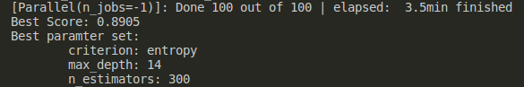

# HyperParamter_optimisation

## This Repo will help you work on Grid Search and Randomized Search CV

- Randomised Search is faster than grid search if the number of iterations in less. Using these two, you can find the optimal(?) paramters for all kinds of model as long as they have a fit and predict fucntion.

Output for RandomSearch Cv:

## I have added a sample code file(.ipynb) for practical reference on the working of Hyperparamter Optimisation.
- Data Source [link](https://www.kaggle.com/uciml/pima-indians-diabetes-database)
- Kaggle [Notebook](https://www.kaggle.com/lokeshrth4617/hyperparamter-modeling-the-beginner-s-guide)

Do STAR mark if you find this repo helpful. 

--- 

Thanks
